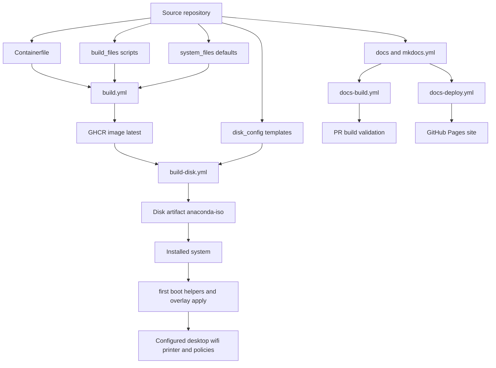

# Sikker Selvbetjening

[](https://github.com/os2borgerpc/sikker-selvbetjening/actions/workflows/docs-deploy.yml)

Custom Fedora Silverblue bootc image and disk image pipeline for a Danish-focused desktop setup.

## Documentation

- Published docs: https://os2borgerpc.github.io/sikker-selvbetjening/
- Docs deployment workflow: https://github.com/os2borgerpc/sikker-selvbetjening/actions/workflows/docs-deploy.yml

## Project flow diagram



## What this project builds

- A custom container image based on `quay.io/fedora-ostree-desktops/silverblue:42`
- Disk artifact currently produced by CI from that image:
	- `anaconda-iso`

The repository is structured so image customization happens in small shell steps under `build_files/`, while defaults and desktop settings are provided from `system_files/`.

## Repository layout

- `Containerfile`
	- Base image definition and build entrypoint
- `build_files/`
	- `build.sh` runs all numbered scripts in lexical order
	- `10-packages.sh` installs packages and Danish language tooling
	- `20-services.sh` enables `podman.socket` and configures a `bootc` update-check timer
	- `25-overlay-helpers.sh` installs the overlay entrypoint and helper scripts
	- `30-gnome-layout.sh` applies dconf defaults
- `system_files/`
	- Contains files copied into the image, including dconf defaults and locale config
- `disk_config/`
	- `disk.toml` for generic disk image customization
	- `iso-gnome.toml` for installer ISO customization
- `.github/workflows/`
	- `build.yml` builds and pushes the container image to GHCR on push to `main`, `bartosz`, and `agnete`
	- `build-disk.yml` currently builds `anaconda-iso` from the published image
	- `docs-build.yml` validates MkDocs builds on PRs/pushes affecting docs
	- `docs-deploy.yml` publishes docs to GitHub Pages from `main`

## How image customization works

The `Containerfile` uses a multi-stage pattern:

1. Copies local build assets into a temporary context stage.
2. Starts from Fedora Silverblue 42.
3. Runs `build_files/build.sh` with build mounts and cache mounts.
4. Runs `bootc container lint` to validate the final image.

`build_files/build.sh` executes all scripts matching `NN-*.sh` in lexical order, so build customization remains easy to extend.

## CI/CD workflows

### Container image workflow

File: `.github/workflows/build.yml`

- Trigger: push to `main`, `bartosz`, `agnete`
- Builds image from `Containerfile`
- Tags with date-based metadata
- Pushes to GHCR as:
	- `ghcr.io/<owner>/<repo>:latest`
	- date variants generated by metadata-action

### Disk image workflow

File: `.github/workflows/build-disk.yml`

- Triggers:
	- manual (`workflow_dispatch`) with platform and upload options
	- PRs touching disk configs/workflow
- Builds one artifact type via matrix:
	- `anaconda-iso`
- Uses `disk_config/iso-gnome.toml` for the current matrix build
- Output destination:
	- GitHub job artifacts (default)
	- S3 (optional)

`disk_config/disk.toml` is still kept in the repository and can be used if `qcow2` is re-enabled in the workflow matrix.

### Docs workflows

Files:

- `.github/workflows/docs-build.yml`
	- Triggers on PR and push to `main` when docs files or MkDocs config changes
	- Validates docs with `mkdocs build --strict`
- `.github/workflows/docs-deploy.yml`
	- Triggers on push to `main` for docs-related changes
	- Builds and deploys docs to GitHub Pages

This gives a Danish-oriented default desktop experience out of the box.

## bootc update checks

The image includes a systemd timer that runs nightly at 02:00 local time and applies updates when available:

- Timer: `bootc-update-check.timer`
- Service: `bootc-update-check.service`
- Command flow: `bootc upgrade --check && bootc upgrade --apply --soft-reboot=auto`

When an update is detected, the system stages it and reboots so the new deployment is applied.

## Desktop background image

The image includes support for applying a system-wide desktop background via GNOME dconf settings. Background configuration is provided by an overlay OS layer through:

- **Config file**: `/usr/share/sikker-selvbetjening/desktop.conf`
- **Assets directory**: `/usr/share/sikker-selvbetjening/assets/`

### How to configure

The overlay layer should provide:

1. **`/usr/share/sikker-selvbetjening/desktop.conf`** with content:
   ```
   background_image_file=<relative-path-to-image>
   ```

2. **Image file** at `/usr/share/sikker-selvbetjening/assets/<image-filename>`

### Example

Overlay providing a background image:

```
/usr/share/sikker-selvbetjening/desktop.conf:
  background_image_file=backgrounds/company-bg.png

/usr/share/sikker-selvbetjening/assets/backgrounds/company-bg.png
```

At boot, the `sikker-selvbetjening-desktop-bg.service` will:
- Read the config file
- Copy the image to `/usr/share/backgrounds/`
- Apply it as the GNOME desktop background for all users
- Configure both light and dark color schemes

## Dependency updates

Dependabot is configured for GitHub Actions updates in `.github/dependabot.yml` on a weekly schedule.

## Notes

- The disk build workflow expects the container image to already exist in GHCR under the default tag.
- If you fork or rename the repository, review image references and tags in workflow env settings.